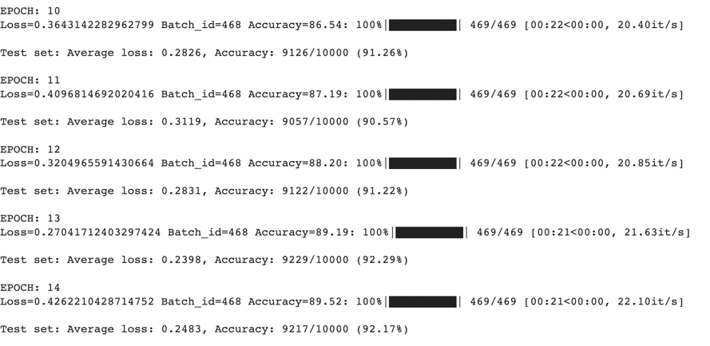

# ERA S6
This is the assignment given in 5th Session, ERA batch of School of AI
# Classification of MNIST Dataset
In this session, the MNIST dataset has been used. It consists of 60,000 training images and 10,000 testing image.
It is a large database of handwritten digits that is commonly used for training various image processing systems.
It has all the same square size images of 28×28 pixels, and they are of grayscale.
# S6 Part 2 - Project Structure
```
.
├── README.md
├── S6.ipynb
```
# S6 Model Summary 
```
----------------------------------------------------------------
        Layer (type)               Output Shape         Param #
================================================================
            Conv2d-1            [-1, 8, 28, 28]              80
              ReLU-2            [-1, 8, 28, 28]               0
       BatchNorm2d-3            [-1, 8, 28, 28]              16
            Conv2d-4           [-1, 16, 28, 28]           1,168
              ReLU-5           [-1, 16, 28, 28]               0
       BatchNorm2d-6           [-1, 16, 28, 28]              32
            Conv2d-7           [-1, 32, 28, 28]           4,640
              ReLU-8           [-1, 32, 28, 28]               0
       BatchNorm2d-9           [-1, 32, 28, 28]              64
        MaxPool2d-10           [-1, 32, 14, 14]               0
           Conv2d-11           [-1, 32, 12, 12]           9,248
             ReLU-12           [-1, 32, 12, 12]               0
      BatchNorm2d-13           [-1, 32, 12, 12]              64
           Conv2d-14           [-1, 10, 12, 12]             330
             ReLU-15           [-1, 10, 12, 12]               0
      BatchNorm2d-16           [-1, 10, 12, 12]              20
AdaptiveAvgPool2d-17             [-1, 10, 1, 1]               0
================================================================
Total params: 15,662
Trainable params: 15,662
Non-trainable params: 0
----------------------------------------------------------------
Input size (MB): 0.00
Forward/backward pass size (MB): 1.19
Params size (MB): 0.06
Estimated Total Size (MB): 1.25
----------------------------------------------------------------
```
# S6 Model Results
In this assigment 99.4% validation accuracy has been achieved with 15K parameters
within 20 epochs
```

```
# S6 Part 1 - BackPropagation 
η = 0.1
```
```
η = 0.2


