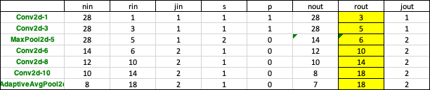
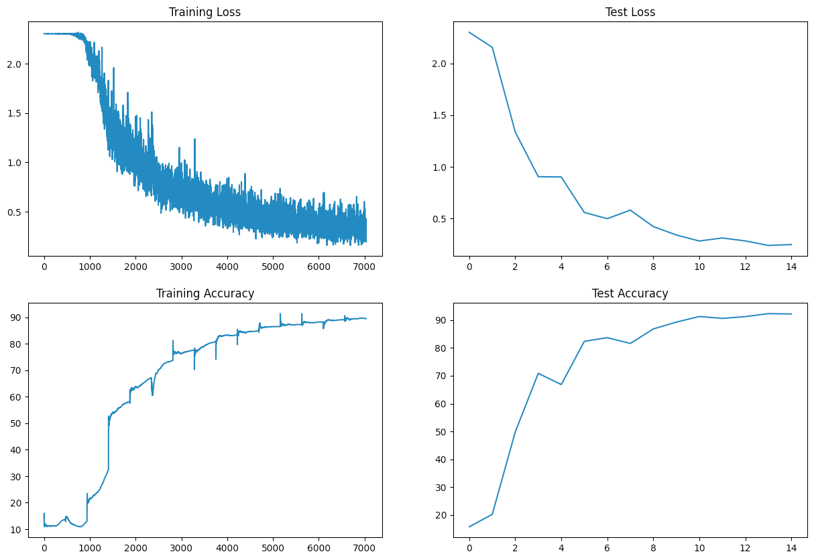
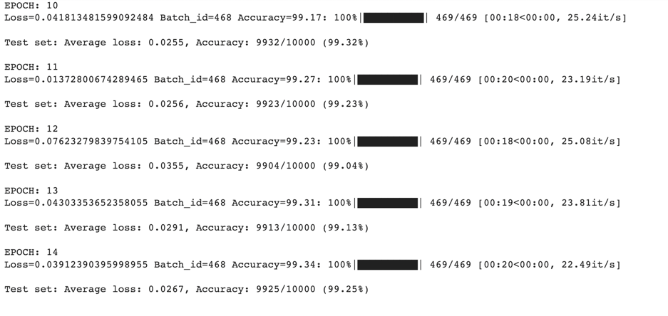
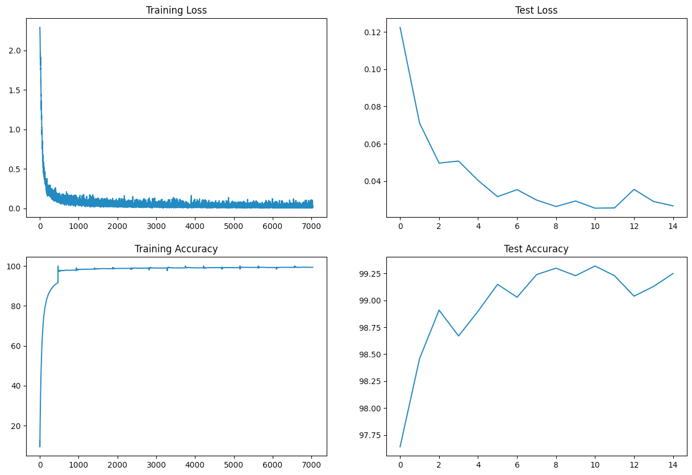
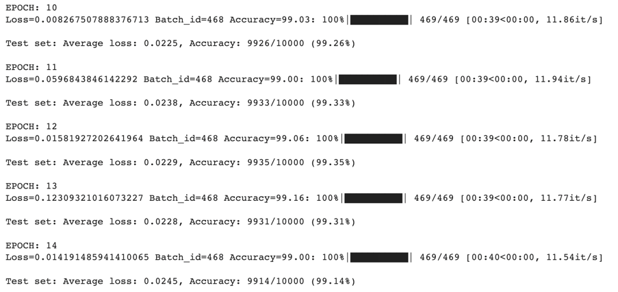
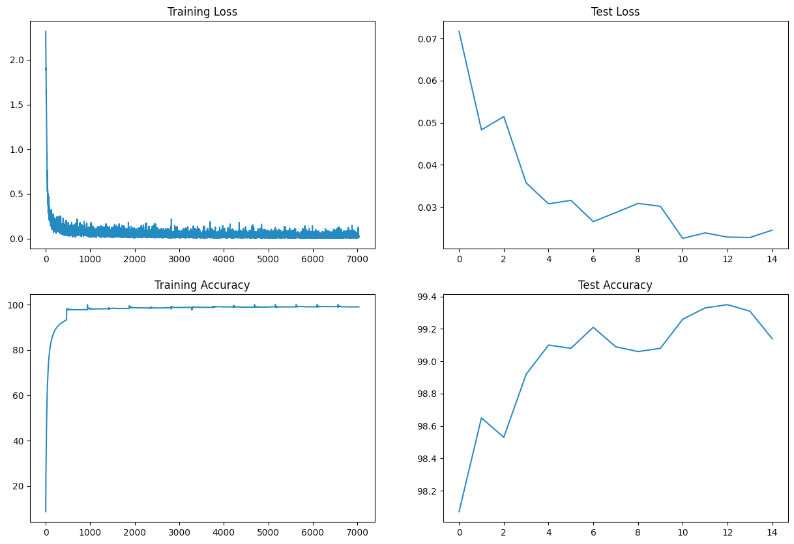
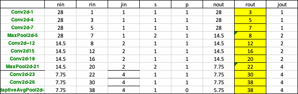
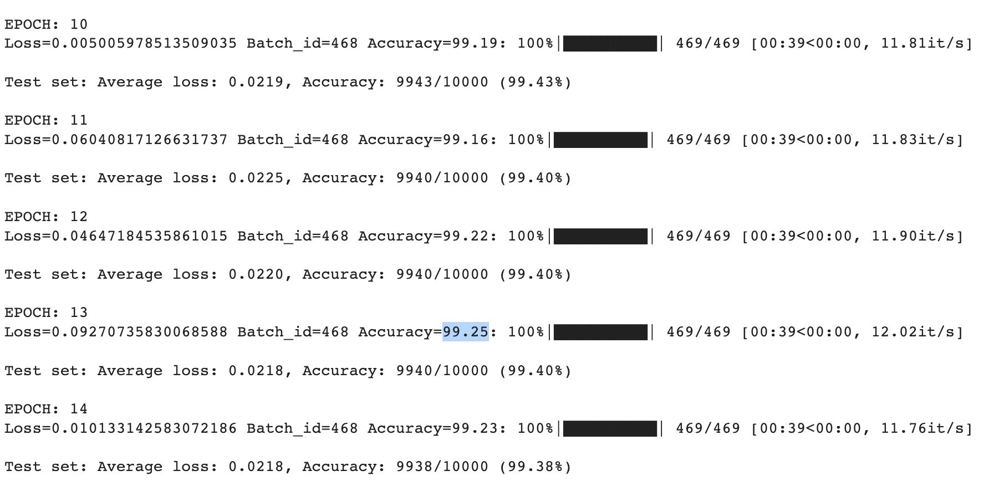
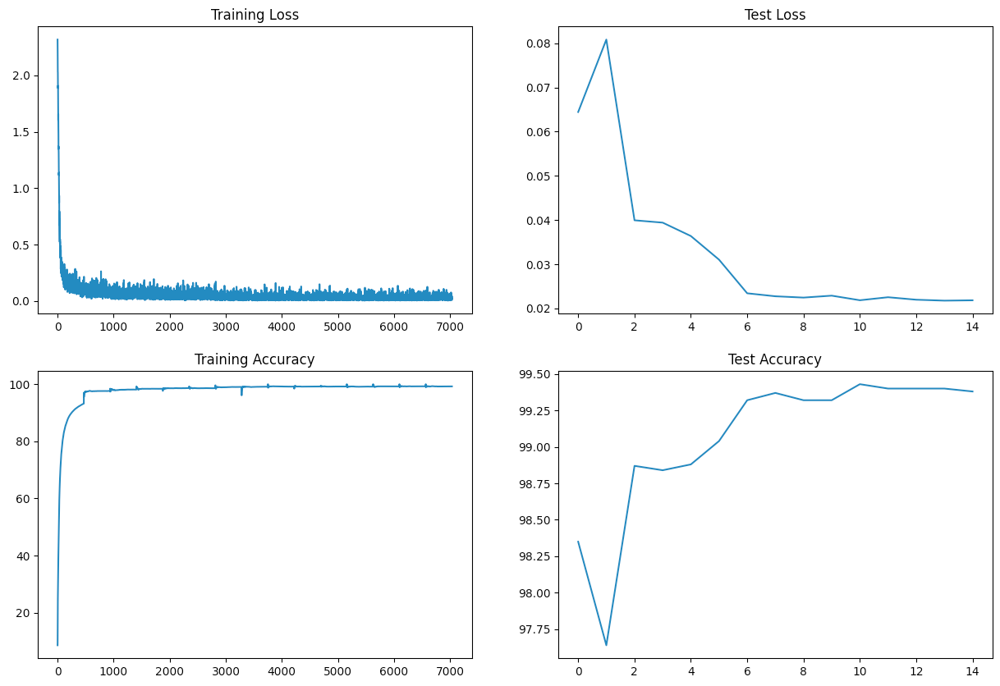

# ERA S7
Objective of this assignment
1. 99.4% (this must be consistently shown in your last few epochs, and not a one-time achievement)
2. Less than or equal to 15 Epochs
3. Less than 8000 Parameters
4. Modular code
5. Analysis in exactly 3 steps  "target, result, analysis" 

# Classification of MNIST Dataset
In this session, the MNIST dataset has been used. It consists of 60,000 training images and 10,000 testing image.
It is a large database of handwritten digits that is commonly used for training various image processing systems.
It has all the same square size images of 28×28 pixels, and they are of grayscale.
# S6 Part 2 - Project Structure
```
.
├── README.md
├── ERAS7_M1.ipynb
├── ERAS7_M2.ipynb
├── ERAS7_M3.ipynb
├── ERAS7_M4.ipynb
├── ERAS7_M4_Final.ipynb
├── model.py
├── utils.py

```
# S7 Model1 Summary 
```
----------------------------------------------------------------
        Layer (type)               Output Shape         Param #
================================================================
            Conv2d-1            [-1, 6, 28, 28]              54
              ReLU-2            [-1, 6, 28, 28]               0
            Conv2d-3           [-1, 12, 28, 28]             648
              ReLU-4           [-1, 12, 28, 28]               0
         MaxPool2d-5           [-1, 12, 14, 14]               0
            Conv2d-6           [-1, 10, 14, 14]             120
              ReLU-7           [-1, 10, 14, 14]               0
            Conv2d-8            [-1, 8, 12, 12]             720
              ReLU-9            [-1, 8, 12, 12]               0
           Conv2d-10           [-1, 10, 12, 12]              80
             ReLU-11           [-1, 10, 12, 12]               0
AdaptiveAvgPool2d-12             [-1, 10, 1, 1]               0
================================================================
Total params: 1,622
Trainable params: 1,622
Non-trainable params: 0
----------------------------------------------------------------
Input size (MB): 0.00
Forward/backward pass size (MB): 0.30
Params size (MB): 0.01
Estimated Total Size (MB): 0.31
----------------------------------------------------------------
```
### Target
1. Modularise the model
2. First network created with lowest parameters possible with convolution layers, gap average pooling
3. Plot the accuracy Metrics
4. Reach a receptive field of 20



### Result
Parameters : 1622
Best Train Accuracy: 89.19%
Best Test Accuracy: 92.29%
### Analysis
The model is underfitting as it has not reached 90% accuracy. The test accuracy is higher than the train accuracy. 
Adding more parameters is the next strategy to increase the training accuracy to 90%




# S7 Model2 Summary 
----------------------------------------------------------------
        Layer (type)               Output Shape         Param #
================================================================
            Conv2d-1            [-1, 8, 28, 28]              80
              ReLU-2            [-1, 8, 28, 28]               0
       BatchNorm2d-3            [-1, 8, 28, 28]              16
            Conv2d-4            [-1, 8, 28, 28]             584
              ReLU-5            [-1, 8, 28, 28]               0
       BatchNorm2d-6            [-1, 8, 28, 28]              16
            Conv2d-7            [-1, 8, 28, 28]             584
              ReLU-8            [-1, 8, 28, 28]               0
       BatchNorm2d-9            [-1, 8, 28, 28]              16
        MaxPool2d-10            [-1, 8, 14, 14]               0
          Dropout-11            [-1, 8, 14, 14]               0
           Conv2d-12           [-1, 12, 14, 14]             876
             ReLU-13           [-1, 12, 14, 14]               0
      BatchNorm2d-14           [-1, 12, 14, 14]              24
           Conv2d-15           [-1, 12, 14, 14]           1,308
             ReLU-16           [-1, 12, 14, 14]               0
      BatchNorm2d-17           [-1, 12, 14, 14]              24
           Conv2d-18           [-1, 12, 14, 14]           1,308
             ReLU-19           [-1, 12, 14, 14]               0
      BatchNorm2d-20           [-1, 12, 14, 14]              24
        MaxPool2d-21             [-1, 12, 7, 7]               0
          Dropout-22             [-1, 12, 7, 7]               0
           Conv2d-23             [-1, 15, 7, 7]           1,635
             ReLU-24             [-1, 15, 7, 7]               0
      BatchNorm2d-25             [-1, 15, 7, 7]              30
           Conv2d-26             [-1, 10, 7, 7]           1,360
             ReLU-27             [-1, 10, 7, 7]               0
      BatchNorm2d-28             [-1, 10, 7, 7]              20
AdaptiveAvgPool2d-29             [-1, 10, 1, 1]               0
================================================================
Total params: 7,905
Trainable params: 7,905
Non-trainable params: 0
----------------------------------------------------------------
Input size (MB): 0.00
Forward/backward pass size (MB): 0.65
Params size (MB): 0.03
Estimated Total Size (MB): 0.69
----------------------------------------------------------------

### Target
1. Create a skeleton for model 
2. Increase the number of parameters for the model1 by increasing the convolutional layers
3. Plot the accuracy Metrics
4. Reach a receptive field of more than 20


### Result
Parameters : 7905
Best Train Accuracy: 99.34%
Best Test Accuracy: 99.25%
### Analysis
The model is very stable with 99.34% training and 99.25% testing accuracy. The model is not overfitting 
but hasn't achieved 99.4% accuracy. To increase the training accuracy, data augmentation can be introduced



# S7 Model3 Summary 
----------------------------------------------------------------
        Layer (type)               Output Shape         Param #
================================================================
            Conv2d-1            [-1, 8, 28, 28]              80
              ReLU-2            [-1, 8, 28, 28]               0
       BatchNorm2d-3            [-1, 8, 28, 28]              16
            Conv2d-4            [-1, 8, 28, 28]             584
              ReLU-5            [-1, 8, 28, 28]               0
       BatchNorm2d-6            [-1, 8, 28, 28]              16
            Conv2d-7            [-1, 8, 28, 28]             584
              ReLU-8            [-1, 8, 28, 28]               0
       BatchNorm2d-9            [-1, 8, 28, 28]              16
        MaxPool2d-10            [-1, 8, 14, 14]               0
          Dropout-11            [-1, 8, 14, 14]               0
           Conv2d-12           [-1, 12, 14, 14]             876
             ReLU-13           [-1, 12, 14, 14]               0
      BatchNorm2d-14           [-1, 12, 14, 14]              24
           Conv2d-15           [-1, 12, 14, 14]           1,308
             ReLU-16           [-1, 12, 14, 14]               0
      BatchNorm2d-17           [-1, 12, 14, 14]              24
           Conv2d-18           [-1, 12, 14, 14]           1,308
             ReLU-19           [-1, 12, 14, 14]               0
      BatchNorm2d-20           [-1, 12, 14, 14]              24
        MaxPool2d-21             [-1, 12, 7, 7]               0
          Dropout-22             [-1, 12, 7, 7]               0
           Conv2d-23             [-1, 15, 7, 7]           1,635
             ReLU-24             [-1, 15, 7, 7]               0
      BatchNorm2d-25             [-1, 15, 7, 7]              30
           Conv2d-26             [-1, 10, 7, 7]           1,360
             ReLU-27             [-1, 10, 7, 7]               0
      BatchNorm2d-28             [-1, 10, 7, 7]              20
AdaptiveAvgPool2d-29             [-1, 10, 1, 1]               0
================================================================
Total params: 7,905
Trainable params: 7,905
Non-trainable params: 0
----------------------------------------------------------------
Input size (MB): 0.00
Forward/backward pass size (MB): 0.65
Params size (MB): 0.03
Estimated Total Size (MB): 0.69
----------------------------------------------------------------
### Target
1. Data augmentation for shifting some of hand-written digits by 8 deg has been introduced.
2.
3. Reach a receptive field of 20
### Result
Parameters : 7905
Best Train Accuracy: 99.16%
Best Test Accuracy: 99.31%
### Analysis
The model is still underfitting. It's test accuracy is higher than train accuracy but it hasn't
reached the target accuracy consistently. Next, is to change the learning rate.



# S7 Model4 Summary 
----------------------------------------------------------------
        Layer (type)               Output Shape         Param #
================================================================
            Conv2d-1            [-1, 8, 28, 28]              80
              ReLU-2            [-1, 8, 28, 28]               0
       BatchNorm2d-3            [-1, 8, 28, 28]              16
            Conv2d-4            [-1, 8, 28, 28]             584
              ReLU-5            [-1, 8, 28, 28]               0
       BatchNorm2d-6            [-1, 8, 28, 28]              16
            Conv2d-7            [-1, 8, 28, 28]             584
              ReLU-8            [-1, 8, 28, 28]               0
       BatchNorm2d-9            [-1, 8, 28, 28]              16
        MaxPool2d-10            [-1, 8, 14, 14]               0
          Dropout-11            [-1, 8, 14, 14]               0
           Conv2d-12           [-1, 12, 14, 14]             876
             ReLU-13           [-1, 12, 14, 14]               0
      BatchNorm2d-14           [-1, 12, 14, 14]              24
           Conv2d-15           [-1, 12, 14, 14]           1,308
             ReLU-16           [-1, 12, 14, 14]               0
      BatchNorm2d-17           [-1, 12, 14, 14]              24
           Conv2d-18           [-1, 12, 14, 14]           1,308
             ReLU-19           [-1, 12, 14, 14]               0
      BatchNorm2d-20           [-1, 12, 14, 14]              24
        MaxPool2d-21             [-1, 12, 7, 7]               0
          Dropout-22             [-1, 12, 7, 7]               0
           Conv2d-23             [-1, 15, 7, 7]           1,635
             ReLU-24             [-1, 15, 7, 7]               0
      BatchNorm2d-25             [-1, 15, 7, 7]              30
           Conv2d-26             [-1, 10, 7, 7]           1,360
             ReLU-27             [-1, 10, 7, 7]               0
      BatchNorm2d-28             [-1, 10, 7, 7]              20
AdaptiveAvgPool2d-29             [-1, 10, 1, 1]               0
================================================================
Total params: 7,905
Trainable params: 7,905
Non-trainable params: 0
----------------------------------------------------------------
Input size (MB): 0.00
Forward/backward pass size (MB): 0.65
Params size (MB): 0.03
Estimated Total Size (MB): 0.69
----------------------------------------------------------------

### Target
1. Learning rate has been increased to 0.05 and scheduler has been setup in steps 6
2. Reach a receptive field of more than 20


### Result
Parameters : 7905
Best Train Accuracy: 99.25%
Best Test Accuracy: 99.40%
### Analysis
 The model has reached a consistent target accuracy of 99.04% after changing the lr
 
 
 